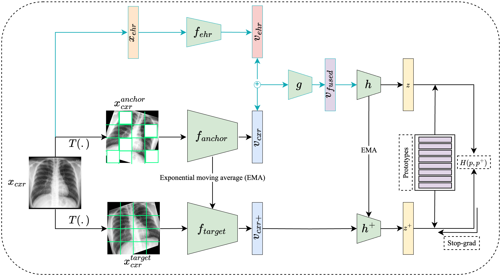

**Enhancing Chest X-Ray Representation Learning with Masked Siamese Networks and Electronic Health Records:**

# Collaborators:

| Name | Role | Institution |
| --- | --- | --- |
| Saeed Shurrab | Rsearch assistant | New York University Abu Dhabi |
| Alejandro Guerra-Manzanares | PostDoc researcher | New York University Abu Dhabi |
| Farah Shamout | Principal investigator | New York University Abu Dhabi |

# Project overview:



## Abstract:

Self-supervised learning methods for medical imaging primarily rely on image data for pretraining. While such approaches deliver promising results, we hypothesize that incorporating associated information from Electronic Health Records (EHR) can enhance the quality of the learned representations. In this paper, we investigate the impact of incorporating three types of EHR data during pretraining using Masked Siamese Networks (MSN) on downstream classification, including socio-demographic, scan metadata, and inpatient stay information. We evaluate our proposal on three publicly available chest X-ray datasets (MIMIC-CXR, CheXpert, and NIH14) using two vision transformer (ViT) backbones, ViT-Tiny and ViT-Small, in linear evaluation and low-data regime fine-tuning. In linear evaluation, our proposed method demonstrates significant improvement compared to \emph{vanilla} MSN and state-of-the-art self-supervised learning baselines and achieves a comparable performance in fine-tuning. Our work highlights the potential of EHR-enhanced pretraining and opens opportunities for future research to address limitations in existing representation learning methods for medical imaging modalities.

# Setup

## Environment setup

Install the the environment as follows: 

```bash
git clone https://github.com/nyuad-cai/CXR-EHR-MSN.git
cd CXR-EHR-MSN
conda env create -f environment.yml
conda activate cxr-ehr-env
```

**Note:** The environment is is installed on **Python version 3.9.12**

### Dataset setup

We use [MIMIC-IV EHR](https://physionet.org/content/mimiciv/1.0/) and [MIMIC CXR](https://physionet.org/content/mimic-cxr-jpg/2.0.0/) for all the experiments. We do not provide both datasets. Users must acquire the data from https://mimic.physionet.org/. After data download, users have to run the EHR preprocessing jupyter notebooks to extract the utlized features and create the datasets. To perform this, perform the following steps:

**Features extract:**

- Run all cells the EHR-data-extract.ipynb notebook located in ./notebooks/ directory
- This notebook will produce CSV file called  ehr_dataset_last.csv
- Following that, run all cells the EHR-data-prep.ipynb notebook located in ./notebooks/ directory.
- This notebooks will create all single variables, groups, and combinations datasets and save them in the same notebooks directory

## Pretraining

```bash
python cxr_ehr_msn_trainer.py --dim 192 \ # ViT hidden dim 192 vs 384
			      --ehr-in 2 \ # ehr input vector dimensionality
			      --ehr-out 128 \ # ehr embedding dimensionality
			      --data-dir path/to/mimic-cxr # cxr.jpeg data dir
			      --log-dir path/to/logs-dir # ehr.csv data file
			      --num-prototypes 1024 \ # number of trainable prototypes
			      --learning-rate 0.0001 \ # learning rate value
			      --weight-decay 0.001 \ # weight decay value
			      --max-epochs 100 # number of tarining epochs
```

## Evaluation

```bash
python evaluate.py --dim 192 \ #ViT hidden dim 192 or 384 
			      --freeze 1 \ # backbone freezing for linear evaluation 1 vs 0
	     		  --dataset mimic \ # evaluation dataset mimic, chexpert, nih
			      --log-dir path/to/logs-dir # loging directory path
			      --scheduler \ # lr scheduler cosine, reduce
			      --learning-rate 0.0001 \ # learning rate value
			      --data-percen  1.0 \ # fraction of data for low data regimes 
             	  --max-epochs 100 \ # number of tarining epochs
```

# Citation

Please consider citing our work when using this repo:
